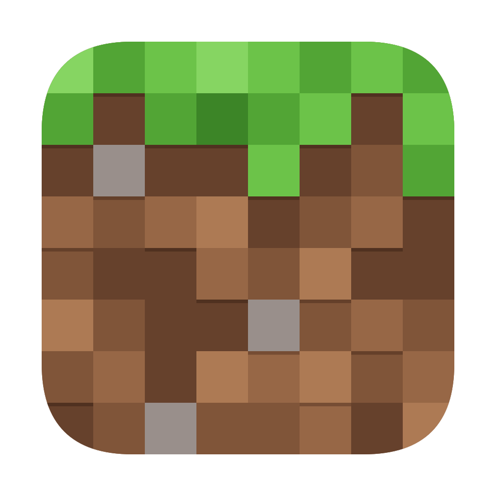

#  Minecraft Launcher

> 一个优雅的原生 macOS Minecraft 启动器，专注于简洁与性能

<!-- [](https://swift.org) -->
<!-- [](https://www.apple.com/macos) -->
<!-- [](LICENSE) -->

<!-- <div align="center">
  
</div> -->

## ✨ 特性

### 🎮 游戏版本管理
- 实时获取 Minecraft 官方版本
- 优雅的版本标签展示
- 智能的版本分类与搜索

### 🚀 即将推出
| 功能 | 状态 |
|------|------|
| 🧩 模组管理 | 开发中 |
| 🎨 资源包管理 | 计划中 |
| 🌈 光影包管理 | 计划中 |
| 📦 数据包管理 | 计划中 |
| 🎁 整合包管理 | 计划中 |
| 👥 多用户配置 | 计划中 |

## 💻 系统要求

- macOS 13.0 或更高版本
- Apple Silicon 或 Intel 处理器

## 🛠 技术栈

| 类别 | 技术 |
|------|------|
| 框架 | SwiftUI, Combine |
| 架构 | MVVM |
| 异步 | async/await |
| 网络 | URLSession |

## 📁 项目结构

```
Launcher/
├── 🏗 Core/
│   ├── 📊 Models/
│   ├── 🔧 Services/
│   └── 🎨 Views/
├── ✨ Features/
│   └── 🎮 GameVersion/
└── 📱 App/
```

## 🚀 快速开始

### 环境准备
1. 安装最新版本的 [Xcode](https://apps.apple.com/us/app/xcode/id497799835)
2. 克隆项目
   ```bash
   git clone https://github.com/suhang12332/minecraft-launcher.git
   cd minecraft-launcher
   ```
3. 打开项目
   ```bash
   open Launcher.xcodeproj
   ```

### 构建运行
- 使用 `⌘ + R` 运行项目
- 使用 `⌘ + B` 构建项目

## 🔗 API

### 版本管理
```endpoint
GET https://launchermeta.mojang.com/mc/game/version_manifest.json
```
获取所有 Minecraft 版本信息，包括：
- 发布版本
- 快照版本
- 发布时间

## 🤝 参与贡献

我们欢迎所有形式的贡献，无论是：
- 🐛 提交 bug
- 💡 新功能建议
- 📝 文档改进
- 🔧 代码优化

### 贡献步骤
1. Fork 项目
2. 创建特性分支
3. 提交改动
4. 推送到分支
5. 提交 Pull Request

## 📄 许可证

本项目采用 MIT 许可证 - 查看 [LICENSE](LICENSE) 了解详情

---

<div align="center">
  <sub>Built with ❤️ by the macOS community</sub>
</div>
